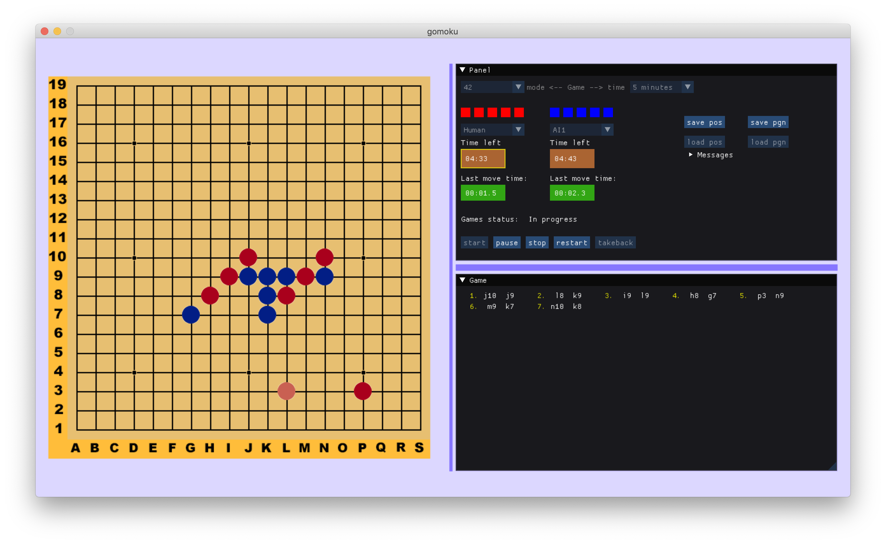

# gomoku

One of my quality pet-projects at `42` written in C++17. 

## About

[`Gomoku`](https://en.wikipedia.org/wiki/Gomoku) is a strategy board game. Goal of the game is to put 5 of your 
stones in a row (It is also called Five-in-a-Row). This game has lots of variations. 
The original one is no more applied, because first player can win the game
[regardless of the opponent's moves](https://habr.com/ru/post/437064/).  

My aim was to code game interface and an Engine for one of variations.

#### Rules

#### Engine

## Build

```bash
# Build was tested only on MacOS, clang-1100.0.33.17
bash install_dependencies.sh
cmake -DCMAKE_BUILD_TYPE="Release" . && make
```

## Usage

```bash
./gomoku
```

## Docs
```
|- build_dir
   |- html
      > index.html 
```

## Screenshots




## License
[MIT](https://choosealicense.com/licenses/mit/)

http://algolist.ru/games/alphabeta.php


